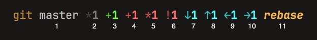
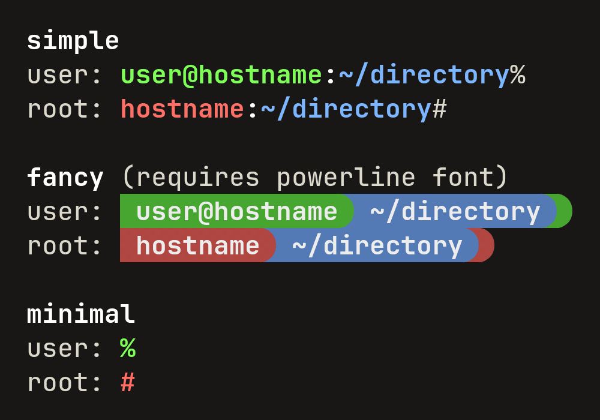

# zk

**zk** is a collection of Zsh configuration files that I use. It is designed to be modular and
extensible, so you can use all plugins together (like I do) or just the ones you want.


## Installation

To install my Zsh configuration, using all plugins, run the following command:

```sh
% curl -sSL https://raw.githubusercontent.com/kugland/zk/master/install.zsh | zsh
```


## zk_gitstatus

**zk_gitstatus** is a Zsh plugin that gives you the current status of the Git repository in
the current directory. It doesn’t actually change the prompt, but provides a global variable
`$__zk_git__status` which can be used in the prompt.

**zk_gitstatus** requires [romkatv/gitstatus](https://github.com/romkatv/gitstatus/).

Here is a preview of the Git status (as shown with `zk_prompt`’s `simple` prompt):

<div align="center"></div>

The elements displayed are:

1. Name of the current branch name, or, if detached, a commit hash or a tag.
2. \# of stashes
3. \# of staged changes
4. \# of unstaged changes
5. \# of untracked files
6. \# of conflicted files
7. \# of commits behind upstream
8. \# of commits ahead of upstream
9. \# of commits behind push remote
10. \# of commits ahead of push remote
11. Action in progress

For repositories with more than 5000 files in the index, staged, unstaged, untracked and
conflicted counts will not be shown, to prevent the prompt from becoming too slow.

Default styles are not provided. The styling is done with two styles in `:plugin:zk_gitstatus`:

- `identifier`: The text to display before the status, like `git` or ``.
- `styles`: an array in the form `(key1 value1 key2 value2 …)`, with the following keys:
  `WHERE_TAG`, `WHERE_COMMIT`, `STASHES`, `NUM_STAGED`, `NUM_UNSTAGED`, `NUM_UNTRACKED`,
  `COMMITS_BEHIND`, `COMMITS_AHEAD`, `PUSH_COMMITS_BEHIND`, `PUSH_COMMITS_AHEAD`, `NUM_CONFLICTED`,
  `ACTION`, `LARGE_REPO`.

For an example, see [prompt/prompt_zk_setup](./prompt/prompt_zk_setup).


## zk_history

**zk_history** configures Zsh history. It sets `HISTFILE` to `$XDG_RUNTIME_DIR/zsh-$UID-history`,
or `/tmp/zsh-$UID-history` if `$XDG_RUNTIME_DIR` is not set, and sets reasonable defaults.


## zk_prompt

**zk_prompt** is my prompt configuration for Zsh, which comes in three flavors: `simple`,
`fancy` and `minimal`. Here is a preview of each:

<div align="center"></div>


## zk_sanetty

**zk_sanetty** is a configuration for the Zsh shell that resets terminal settings every time a new
prompt is displayed. This is useful when programs exit abnormally and leave the terminal in a bad
state, or when you just `cat /dev/random` and the terminal is left all messed up. It also loads
Zsh module `zsh/nearcolor` to approximate 24-bit colors on 256-color terminals.

**zk_sanetty** accepts a single option, `:plugin:zk_sanetty reset-extra` (an array), with extra
escape sequences to reset the terminal. I use this to set the color palette on Linux VTs.


## zk_windowtitle

**zk_windowtitle** sets the window title of the terminal emulator to the current working directory.

Here is an example configuration for the window title format (these are the default values):

```sh
# Normal title is 'cmd • ~/directory', or '🔓 cmd • ~/directory' when running as root.
zstyle :plugin:zk_windowtitle format '%1(p.🔓 .)%c • %d'
# Title for tmux is just 'cmd' (the working directory can be sent with OSC 7).
zstyle :plugin:zk_windowtitle format_tmux '%c'
# Maximum length of the directory (larger directores will be ellipsized with '…').
zstyle :plugin:zk_windowtitle dir_maxlen 40
# Maximum length of an element in the directory (larger elements will be ellipsized).
zstyle :plugin:zk_windowtitle elm_maxlen 20
# Maximum length of the command (larger commands will be ellipsized).
zstyle :plugin:zk_windowtitle cmd_maxlen 32
```

In the format string, `%c` is the command name, `%d` is the current working directory, and `%p` is
1 if running with root privileges, 0 otherwise.


## zk_zle

**zk_zle** is a configuration for Zsh Line Editor (ZLE). It simplifies the key bindings by
removing lots of the default bindings, including whole keymaps (e.g. `viins`, `vicmd`, `emacs`),
and provides a more intuitive (at least for me) set of key bindings.

### Key Bindings

| Key(s)                              | Action                                             |
| ----------------------------------- | -------------------------------------------------- |
| `Tab`                               | Complete/expand                                    |
| `Backspace`                         | Delete character before the cursor                 |
| `Ctrl`+`Backspace`                  | Delete word before the cursor                      |
| `Insert`                            | Toggle overwrite/insert mode                       |
| `Delete`                            | Delete character under the cursor                  |
| `Ctrl`+`Delete`                     | Delete word after the cursor                       |
| `Home` / `End`                      | Move cursor to the beginning/end of the line       |
| `Ctrl`+`Home` / `Ctrl`+`End`        | Move cursor to the beginning/end of the buffer     |
| `Page Up` / `Page Down`             | Search history backward/forward[^PgUpPgDown]       |
| `↑` / `↓`                           | Previous/next in history                           |
| `←` / `→`                           | Move cursor left/right                             |
| `Ctrl`+`←` / `Ctrl`+`→`             | Move cursor left/right by one word                 |
| `Ctrl`+`Alt`+`←` / `Ctrl`+`Alt`+`→` | Move cursor to the beginning/end of line           |
| `Ctrl`+`C`                          | Interrupt                                          |
| `Ctrl`+`D`                          | Cancel line if line is not empty, exit otherwise   |
| `Ctrl`+`F`                          | Insert quoted path as next argument[^fzf]          |
| `Ctrl`+`L`                          | Clear screen                                       |
| `Ctrl`+`P`                          | Repeat previous argument                           |
| `Ctrl`+`R`                          | Enter incremental history search                   |
| `Ctrl`+`T`                          | Change top of directory stack[^fzf]                |
| `Ctrl`+`U`                          | Delete whole line                                  |
| `Ctrl`+`V`                          | Paste from X11 or Wayland clipboard[^CtrlV]        |
| `Ctrl`+`Z` / `Ctrl`+`Y`             | Undo/redo                                          |
| `Ctrl`+`Enter`                      | Accept line and hold in buffer                     |
| `Shift`+`Enter`                     | New line                                           |
| `Space`                             | Insert space and perform history expansion         |
| `Enter`                             | Accept line                                        |
| `Ctrl`+`Enter`                      | Accept line and hold in buffer                     |
| `Shift`+`Enter`                     | Insert newline                                     |
| `Ctrl`+`'` / `Esc`+`'`              | Quote line                                         |

[^PgUpPgDown]: Either builtin Zsh (`history-beginning-search-*`), or substring search with
[zsh-history-substring-search]. See below for details.

[^fzf]: Requires [fzf].

[fzf]: https://github.com/junegunn/fzf

[^CtrlV]: This keybinding will try to paste with [xclip] under X11 or [wl-clipboard] under Wayland,
when these are not available, or when running under SSH, it will try to use [OSC 52].

[xclip]: https://github.com/astrand/xclip
[wl-clipboard]: https://github.com/bugaevc/wl-clipboard
[OSC 52]: https://web.archive.org/web/20240311061433/https://invisible-island.net/xterm/ctlseqs/ctlseqs.html#h4-Operating-System-Commands:OSC-Ps;Pt-ST:Ps-=-5-2.101B

### Using zsh-history-substring-search

To use [zsh-history-substring-search] with **zk_zle**, add the following to your `.zshrc` before
calling `zk_zle-init`:

```sh
zstyle :plugin:zk_zle use-history-substring-search yes
```

[zsh-history-substring-search]: https://github.com/zsh-users/zsh-history-substring-search

### Overwrite/Insert mode

The overwrite/insert mode is indicated by the cursor shape. By default, on xterm-compatible
terminals, the cursor will be `│` in insert mode and `_` in overwrite mode; on Linux VT, the
defaults are `_` and `█`, respectively. You can change the cursor shape by setting styles with
the appropriate escape sequences. For example:

```sh
zstyle :plugin:zk_zle insert_cursor '\e[3 q\e[?6c'
zstyle :plugin:zk_zle overwrite_cursor '\e[5 q\e[?2c'
```

The escape sequences on xterm-compatible terminals is `\e[?n q`, where `n` is one of the following:
`0`: blinking block (default), `1`: blinking block, `2`: steady block, `3`: blinking underline,
`4`: steady underline, `5`: blinking bar and `6`: steady bar.

On Linux VTs, the sequence is `\e[?nc`, where `n` is one of the following: `0`: default,
`1`: invisible, `2`: underscore, `3`: lower third, `4`: lower half, `5`: two thirds,
`6`: full block.

For more information, see XTerm’s [ctlseqs.txt] and the article [Cursor Appearance on Linux Console]
on Linux Gazette.

[ctlseqs.txt]: https://web.archive.org/web/20240311061433/https://invisible-island.net/xterm/ctlseqs/ctlseqs.html#h4-Functions-using-CSI-_-ordered-by-the-final-character-lparen-s-rparen:CSI-Ps-SP-q.1D81
[Cursor Appearance on Linux Console]: https://web.archive.org/web/20220928023334/https://linuxgazette.net/137/anonymous.html
